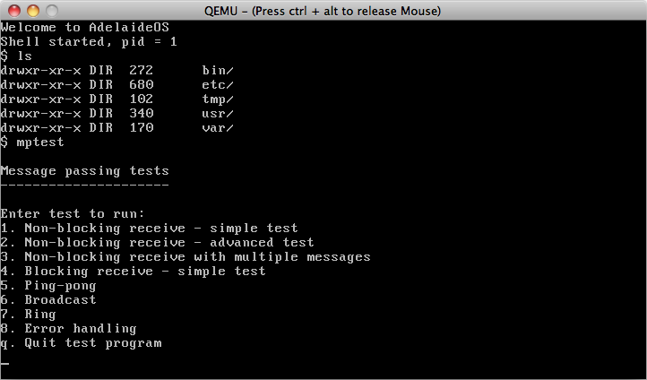

# AdelaideOS

AdelaideOS is a small operating system kernel designed for teaching
purposes. It was developed in 2008 for use in the [operating
systems](http://www.cs.adelaide.edu.au/users/third/os/) course at [Adelaide University](http://cs.adelaide.edu.au).

    

The kernel is around 5,000 lines of code, and has the following features:

- A minimal C library containing `printf` and several string-manipulation functions
- Dynamic memory allocation (`malloc`)
- Multitasking and memory protection
- UNIX-style process management using `fork`, `execve`, and `waitpid`
- Interprocess communication using pipes & message passing
- A read-only ramdisk-based filesystem

The code is split into [nine different versions](dist), each of which builds
on the previous one and adds one or more new features. The purpose of
this arrangement is to
demonstrate how one can start with a very simple kernel and add
features piece by piece. It also permits the kernel to be used as a
teaching aid, whereby each new version of the kernel can be covered in
a week, and at the end of the semester students will have seen how to
construct many of the essential components of a UNIX-like operating
system. A series of accompanying [lecture notes](web/guide.pdf) explain the full
details of the kernel's operation, and can be used as a study guide by
students while working through a course.

The breakdown of features introduced in each version are as follows:

- Version 1: Displays "Hello world", and illustrates the use of
  keyboard & timer interrupt handlers

- Version 2: Introduces a few basic C library functions such as such
as `memset`, `strlen`, `strcmp`, and `printf`

- Version 3: Initial multitasking support. All processes run in
kernel mode, and have direct acceess to physical memory

- Version 4: Virtual memory and memory protection. All processes run
in user mode and can only access memory mapped into their own private
address space

- Version 5: System calls

- Version 6: `malloc` implementation using buddy allocation

- Version 7: Support for pipes and I/O redirection via file descriptors

- Version 8: `fork` and `exec`, plus a basic filesystem

- Version 9: Solutions to the two practical exercises: message passing and POSIX-style filesystem access

The source code for AdelaideOS is in the public domain.

<h1>Download</h1>

- [AdelaideOS source code, release 1.0](https://github.com/peterkelly/adelaideos/releases/download/v1.0/adelaideos-1.0.tar.bz2)
- [AdelaideOS kernel development guide](web/guide.pdf)
- [Practical exercise: Inter-process communication](web/prac2.pdf)
- [Practical exercise: Filesystem access](web/prac3.pdf)

Build instructions are given in the kernel development guide. **Note**: The build scripts only work
on 32-bit Linux systems.

The nine different versions are all generated from a common
source. The original source files and scripts used to generate the different versions can
be accessed from the [project Git repository](https://github.com/peterkelly/adelaideos).

For any questions about AdelaideOS, please contact [Peter Kelly](https://www.pmkelly.net/).

    

</body>
</html>
